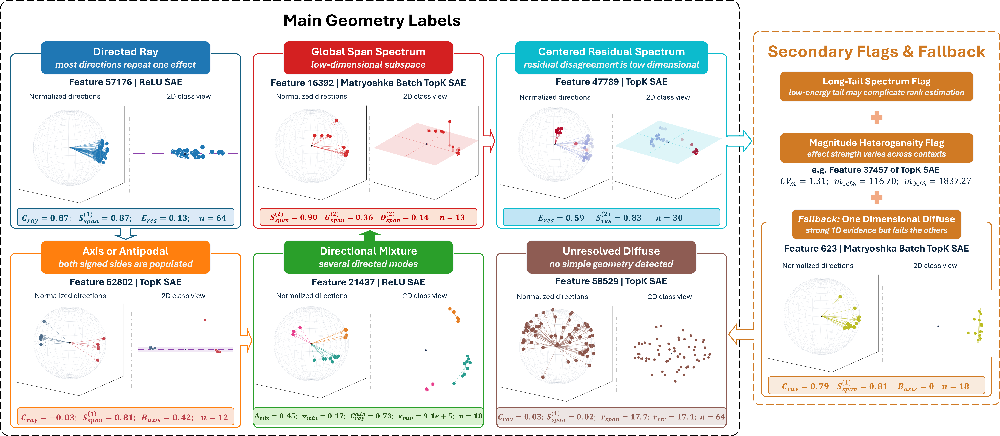

# FEGA: Feature-Effect Geometry Analysis

[](#citation)
[](LICENSE)
[](SETUP.md)

Code and experiment artifacts accompanying the paper
**“Sparse Autoencoders Encode Both Concepts and Functions: The Downstream
Geometry of Feature Effects”** by
[Phu Gia Hoang](https://phusroyal.github.io/),
[Anwoy Chatterjee](https://c-anwoy.github.io/),
[Tanmoy Chakraborty](https://tanmoychak.com),
[Iryna Gurevych](https://www.informatik.tu-darmstadt.de/ukp/ukp_home/head_ukp/index.en.jsp),
and [Subhabrata Dutta](https://subha0009.github.io/)
(UKP Lab, Technical University of Darmstadt), 2026.



> **Disclaimer.** This repository contains experimental software and is published for the sole purpose of giving additional background details on the respective publication.

## Abstract

Wide-scale adoption of sparse autoencoders (SAEs) as robust interpretability
tools has been hindered by inconsistent links between SAE features and output
behavior: features with clear activation descriptions may have weak or
unexpected causal effects, steering can vary across prompts or oppose the
intended direction, and activation-based feature selection can miss features
with the desired output effect. Prior work has studied the geometry of features
inside the model, where they are computed; we instead study the geometry induced
by their output-side effects. We introduce Feature-Effect Geometry Analysis
(FEGA), an unsupervised framework that removes the same active SAE latent across
many contexts, represents the resulting downstream logit-effect vectors as an
empirical cloud in logit space, and tests this cloud's geometry rather than
reducing the feature to a single steering object. Across SAE variants, clean
one-dimensional effects are rare: most causally relevant features do not behave
like reusable directions. To interpret this variation, we distinguish
*value-like* features, tied to static information such as factual attributes and
yielding more structured, low-dimensional effect geometry, from *pointer-like*
features, which implement context-dependent operations and almost always induce
a diffused geometry. Our work characterizes SAE feature geometry in effect
space, connecting feature geometry, steering, and semantic multiplicity.

## Overview

FEGA removes one active SAE feature in many contexts and records how the output
changes. It then asks whether those changes follow one direction, lie in a small
subspace, form several groups, or remain diffuse. The figure above shows the
reported families, extra flags, and fallback result.

A run separates steps that need the model from steps that reuse saved results:

| Phase | Purpose | Typical hardware |
| --- | --- | --- |
| `data_prep` | Select contexts and prepare inputs. | CPU or GPU |
| `compute_effect` | Measure the output change after feature removal. | GPU |
| `geometry_metrics` | Measure the shape of those changes. | CPU |
| `vmf` | Find one or more common directions. | CPU |
| `stability` | Check whether the selected family repeats under resampling. | CPU |
| `geometry_reporting` | Write records, summaries, and figures. | CPU |

Each phase writes reusable artifacts beneath the configured run directory.
Later phases can reuse them without loading the language model again.

## Repository structure

```text
.
├── fega/                   FEGA implementation and experiment configurations
├── scripts/                Setup, local, validation, and Slurm entry points
├── external/               Retained upstream code and experiment wrappers
├── tests/                  Unit, integration, and opt-in hardware tests
├── figures/                README and publication-facing figures
├── data/                   Generated datasets, caches, and intermediate inputs
└── results/                Generated FEGA results and visualizations
```

Generated `data/` and `results/` artifacts are not distributed through Git.

## Setup

The project uses Python 3.10.19 and [`uv`](https://docs.astral.sh/uv/). See
[`SETUP.md`](SETUP.md) for configs, scripts, caches, and common errors. Quick
start:

```bash
git clone https://github.com/UKPLab/FEGA.git
cd FEGA
bash scripts/setup.sh
source scripts/activate.sh
python -m nltk.downloader brown
hf auth login
```

Gemma-2 and the SAE checkpoints require Hugging Face access.
`scripts/activate.sh` configures the environment and cache directories but never
loads machine-specific credentials.

## Reproducing the experiments

Run commands from the repository root. Choose the closest YAML file under
`fega/config/`, then change its input paths, SAE, output path, and phases.

### Value-like RAVEL experiment

First generate the RAVEL evaluation and MDBM inputs:

```bash
python external/custom_eval_instance.py --device cuda:0 --batch_size 128
```

The script writes reusable files beneath
`data/instance_eval_results/ravel/`, `data/artifacts/ravel/`, and
`data/mdbm/ravel/`. Change the configuration block near the top of the script
to select another model or SAE.

Next, run the GPU phases and then the CPU phases:

```bash
export FEGA_CONFIG=fega/config/ravel/matryoshka/city_country_2pow16.yaml
bash scripts/slurm/sbatch_cli_gpu.sh
# Submit the next job after the GPU phases complete successfully.
bash scripts/slurm/sbatch_yolo.sh
```

The GPU launcher defaults to `data_prep,compute_effect,geometry_metrics`; the
`yolo` launcher defaults to `vmf,stability,geometry_reporting`. Change
`FEGA_CONFIG` or `FEGA_PHASES` rather than editing the launchers.

### Pointer-like and hybrid experiments

Generate the LSC, WC, TT, and PrOntoQA datasets:

```bash
TASKS="lsc wc tt prontoqa" \
MODEL_NAME=gemma-2-2b \
TARGET_EXAMPLES=50000 \
NUM_FAMILIES=1000 \
SEED=0 \
BATCH_SIZE=32 \
DEVICE=cuda:0 \
EXTRA_ARGS="--family-pool-multiplier 10 --candidates-per-family-round 64 --max-candidates-per-family 100000" \
bash external/sae_bench/evals/icl_features/scripts/generate_datasets.sh
```

Validate those inputs and run the three-SAE comparison:

```bash
MODEL_NAME=gemma-2-2b \
DATA_ROOT=data/icl_features \
bash external/sae_bench/evals/icl_features/scripts/validate_datasets.sh

RANDOM_TRIALS=20 \
DEVICE=cuda:0 \
bash external/sae_bench/evals/icl_features/scripts/run_saebench_gemma2b_width2pow16_three_saes.sh
```

A small end-to-end check is available through
`external/sae_bench/evals/icl_features/scripts/run_saebench_gemma2b_width2pow16_smoke_test.sh`.
The detailed runbook is
[`external/sae_bench/evals/icl_features/README.md`](external/sae_bench/evals/icl_features/README.md).

### Expected outputs

A completed value-like run contains, beneath its configured run root:

```text
run_status.json
vmf/pre_softcap_logits/vmf_scores.json
stability/stability_scores.json
geometry_reporting/geometry_feature_records.json
geometry_reporting/figures/geometry_atlas.png
```

Use a result only after the requested phases are marked successful in
`run_status.json`. The pointer-like comparison records its final audit at
`results/sae_geometry_gemma2b_65k/paper_artifact_audit.json`.

Large datasets, model and SAE downloads, caches, and results are excluded from
Git.

## Numerical reproducibility

The standard vMF path is `dense_cpu`. It needs no GPU after effect files have
been created. Small numerical differences can occur across CPUs, math libraries,
drivers, and GPUs. Compare the selected vMF model and final geometry label, not
JSON files byte for byte. [`SETUP.md`](SETUP.md) explains the optional faster
backends.

## Per-feature visualizations

Render the cached features with the most valid contexts in each family:

```bash
python -m fega.cli visualize \
  --run-dir results/fega/<dataset>/<sae-run>/<entity>_<attribute> \
  --top-n 5 \
  --dpi 300
```

The command writes one folder per feature with the sphere, 2D view, paper card,
and metrics. Use `--palette-json palette.json` to change colors with hex codes.

## Citation

A preprint will be made available publicly; please check back here for the final
citation once it is posted.

```bibtex
@article{hoang2026sparse,
  title  = {Sparse Autoencoders Encode Both Concepts and Functions: The Downstream Geometry of Feature Effects},
  author = {Hoang, Phu Gia and Chatterjee, Anwoy and Chakraborty, Tanmoy and Gurevych, Iryna and Dutta, Subhabrata},
  year   = {2026},
  note   = {Preprint, link to be added.}
}
```

Machine-readable software and paper citation metadata are provided in
[`CITATION.cff`](CITATION.cff).

## Third-party resources

| Resource | Use in FEGA | Upstream | License or distribution status |
| --- | --- | --- | --- |
| RAVEL | Value-like entity–attribute experiments | [`explanare/ravel`](https://github.com/explanare/ravel) | MIT |
| SAEBench | RAVEL evaluation and SAE integration components | [`adamkarvonen/SAEBench`](https://github.com/adamkarvonen/SAEBench) | No confirmed license for the retained snapshot; not covered by FEGA's Apache-2.0 license |
| spherecluster | Basis for spherical k-means and vMF mixture routines | [`jasonlaska/spherecluster`](https://github.com/jasonlaska/spherecluster) | MIT; FEGA retains an adapted implementation |
| ICL investigation tasks | Pointer-like and hybrid task definitions | [`UKPLab/tmlr2025-icl-investigation`](https://github.com/UKPLab/tmlr2025-icl-investigation) | Apache-2.0 |
| PrOntoQA | Synthetic reasoning-task generation | [`asaparov/prontoqa`](https://github.com/asaparov/prontoqa) | Apache-2.0 |
| Gemma models and SAE checkpoints | Models and SAEs downloaded when needed | Relevant Hugging Face model cards | Not redistributed; their own terms apply |

See [`NOTICE`](NOTICE) for retained and adapted material.

## Maintainer

- **Phu Gia Hoang** — [phu.hoang@tu-darmstadt.de](mailto:phu.hoang@tu-darmstadt.de)

For paper-related questions, the co-authors are listed in the citation above.

## Links

- [FEGA repository](https://github.com/UKPLab/FEGA)
- [UKP Lab](https://www.ukp.tu-darmstadt.de/)
- [Technical University of Darmstadt](https://www.tu-darmstadt.de/)

## License

FEGA-authored code is released under the [Apache License 2.0](LICENSE).
Third-party code, data, models, and adapted material retain their own terms; see
[`NOTICE`](NOTICE), the license files beneath `external/`, and
`THIRD_PARTY_LICENSES/` for details.

`external/sae_bench` is retained for private research reproducibility, but its
snapshot has no confirmed license. It must not be publicly redistributed until
permission or an applicable license is confirmed.
