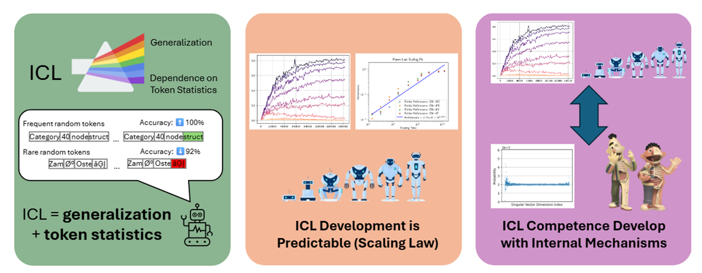

Illusion or Algorithm?
Investigating Memorization, Emergence, and Symbolic Processing in In-Context Learning.  
------
[](https://arxiv.org/abs/2505.11004)  
**Authors:** [Jingcheng Niu](https://frankniujc.github.io/), [Subhabrata Dutta](https://subha0009.github.io/), [Ahmed Elshabrawy](https://scholar.google.com/citations?user=dS7MEN8AAAAJ&hl=en), [Harish Tayyar Madabushi](https://www.harishtayyarmadabushi.com/), and [Iryna Gurevych](https://www.informatik.tu-darmstadt.de/ukp/ukp_home/head_ukp/index.en.jsp).

> **Abstract:** Large-scale Transformer language models (LMs) trained solely on next-token prediction with web-scale data can solve a wide range of tasks after seeing just a few examples. The mechanism behind this capability, known as in-context learning (ICL), remains both controversial and poorly understood. Some studies argue that it is merely the result of memorizing vast amounts of data, while others contend that it reflects a fundamental, symbolic algorithmic development in LMs. In this work, we introduce a suite of investigative tasks and a novel method to systematically investigate ICL by leveraging the full Pythia scaling suite, including interim checkpoints that capture progressively larger amount of training data. By carefully exploring ICL performance on downstream tasks and simultaneously conducting a mechanistic analysis of the residual stream's subspace, we demonstrate that ICL extends beyond mere "memorization" of the training corpus, yet does not amount to the implementation of an independent symbolic algorithm. Our results also clarify several aspects of ICL, including the influence of training dynamics, model capabilities, and elements of mechanistic interpretability. Overall, our work advances the understanding of ICL and its implications, offering model developers insights into potential improvements and providing AI security practitioners with a basis for more informed guidelines.

<p align="center">
  
</p>


Contact: [Jingcheng Niu](mailto:jingcheng.niu@tu-darmstadt.de) and [Subhabrata Dutta](mailto:subhabrata.dutta@tu-darmstadt.de)
@ [UKP Lab](https://www.ukp.tu-darmstadt.de/) | [TU Darmstadt](https://www.tu-darmstadt.de/)

💬 Got questions? Don't hesitate to shoot us an email or open an issue. We're happy to help! 😄

## ICL Tasks

We produce the results in **Sections 4–6** of our paper using the ICL tasks implemented in this code base. These tasks are designed to probe different aspects of in-context learning, such as copying, symbolic substitution, and pattern induction.

See [`example.ipynb`](./example.ipynb) for runnable demos and usage instructions showing how we generate and evaluate these tasks across Pythia model checkpoints.

## Singular Residual Stream Direction Analysis (SUDA)

Finally, we present a mechanistic connection between the development of ICL competence and specialization in the residual stream’s subspace through Singular Unembedding Direction Analysis (SUDA).

SUDA is a diagnostic method that projects the residual stream onto the singular vectors of the unembedding matrix, allowing us to trace how models allocate subspace as they learn to perform in-context learning. Specifically, we:

1. Compute a singular value decomposition of the unembedding matrix: $SVD(W_U) = UST^\top$.
2. Project the residual stream activations onto individual directions in $V$.
3. Measure the task-relevant signal captured by each direction by evaluating how well the model performs when using only a subset of directions.

Across a diverse set of ICL tasks, we observe that while the performance trajectories vary (some tasks improve steadily, others show late or abrupt development) the underlying trend of internal structural formation in the residual stream remains consistent. This suggests that models consistently learn to specialize subspaces in a task-relevant way as training progresses.

The implementation is available at [`icl_analysis/suda.py`](icl_analysis/suda.py). 


Here's what each command-line argument does when you run the script:
| Argument      | Type (after `argparse` parsing) | What it represents                                                                                                                                                                                                                                                                        | Typical value / example    |
| ------------- | ------------------------------- | ----------------------------------------------------------------------------------------------------------------------------------------------------------------------------------------------------------------------------------------------------------------------------------------- | -------------------------- |
| `split`       | `int` (required positional)     | Which "chunk" of training-step checkpoints you want to process.  The script slices the full list of `steps` into blocks of 40 elements. <br> `split = 0` → first 40 checkpoints <br> `split = 1` → next 40, and so on.                                                                    | `0`, `1`, `2`, …           |
| `vh_path`     | `str` (required positional)     | Filesystem path to the directory that already contains the pre-computed singular-vector matrices `pythia_12b_stepXXXX.pt` (your **Vh** files).  The script loads one of these for each checkpoint step.                                                                                   | `"/home/user/vh_matrices"` |
| `output_path` | `str` (required positional)     | Directory where you want the script to write its results for every processed step.  Each run produces one file per checkpoint named `pythia_12b_<step>.pt` that stores the averaged logits and probabilities.  The directory must exist (or be creatable by the user running the script). | `"./results_split0"`       |


## Cite

Please use the following citation:

```bibtex
@misc{niu2025illusionalgorithminvestigatingmemorization,
      title={Illusion or Algorithm? Investigating Memorization, Emergence, and Symbolic Processing in In-Context Learning}, 
      author={Jingcheng Niu and
        Subhabrata Dutta and
        Ahmed Elshabrawy and
        Harish Tayyar Madabushi and
        Iryna Gurevych},
      year={2025},
      eprint={2505.11004},
      archivePrefix={arXiv},
      primaryClass={cs.CL},
      url={https://arxiv.org/abs/2505.11004}, 
}
```
